

  

    
The 2nd Workshop & Challenge on Subtle Visual Computing (SVC) @ CVPR 2026

    
Text-guided Fine-Grained Video Anomaly Understanding

    
Pixel Evidence to Language Reasoning

    
<b>Jihao (Geo) Gu</b>1, Kun Li2, He Wang1, Kaan Akşit1

    
1University College London · 2CVLab, United Arab Emirates University

    

      Video Anomaly Understanding (VAU)
      Subtle Visual Computing
      Large Vision-Language Models (LVLMs)
      Evidence-grounded QA
    

  

    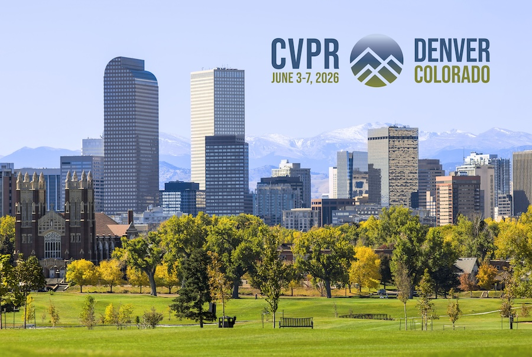
  

  

    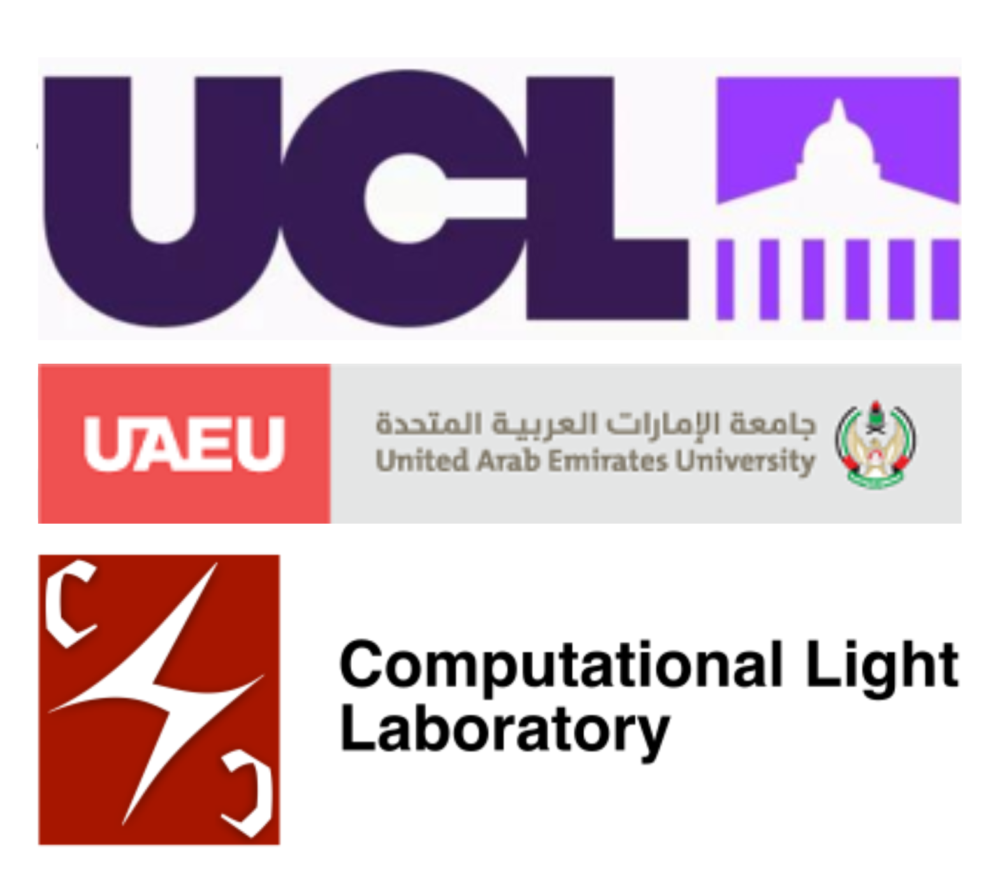
  

<SlideCurrentNo /> / <SlidesTotal />

<!--
Today I present T-VAU, a framework for fine-grained video anomaly understanding. The goal is simple: connect pixel-level evidence with language reasoning.
-->

---

  

    
Motivation

  

  <SlideCurrentNo /> / <SlidesTotal />

<!--
I will start with the motivation. The key issue is that subtle anomalies need both precise evidence and clear explanations.
-->

---

Existing paradigms are fragmented

  

    
Traditional IAD / VAD

    
Image Anomaly Detection / Video Anomaly Detection

    

      Produces anomaly scores or heatmaps, but usually lacks semantic explanation.
    

    

      Output: score / heatmap only
    

    
Rep. works: Sultani et al. (UCF-Crime), CVPR 2018; Bergmann et al. (MVTec AD), CVPR 2019

  

  

    
General LVLMs

    
Large Vision-Language Models

    

      Can answer in language, but often fails to ground subtle cues at pixel level.
    

    

      Output: judgment without explicit evidence
    

    
Rep. works: Liu et al. (LLaVA), NeurIPS 2023; Bai et al. (Qwen-VL), arXiv 2023

  

  

    
LVLM + Diffusion hybrids

    
Language reasoning with generative visualization

    

      Combine text and visualization, but generated explanations may be unstable or inconsistent.
    

    

      Output: judgment + generated visualization
    

    
Rep. works: Wang et al. (LaVin-DiT), CVPR 2025; Li et al. (Dual Diffusion), CVPR 2025

  

  

    
T-VAU

    
Text-guided Fine-Grained Video Anomaly Understanding

    

      Couples pixel-level anomaly evidence with language reasoning.
    

    

      Output: detection + localization + identification + trajectory + explanation
    

    
This work: Gu et al., CVPRW SVC 2026

  

  <SlideCurrentNo /> / <SlidesTotal />

<!--
Existing paradigms solve only part of the problem. Traditional IAD and VAD give scores or heatmaps, while LVLMs give text but often miss pixel-level grounding. T-VAU connects these two sides.
-->

---

What does video anomaly detection need to achieve?

  

    A video anomaly should be 
    
      detected,
      localized and
      explained.
    
  

  

    Fine-grained anomaly understanding asks the model to answer:
  

  

    
Is there any anomaly?

    
Where are the abnormal pixels?

    
What is the target's appearance?

    
How does the target move, and why is it abnormal?

  

  

    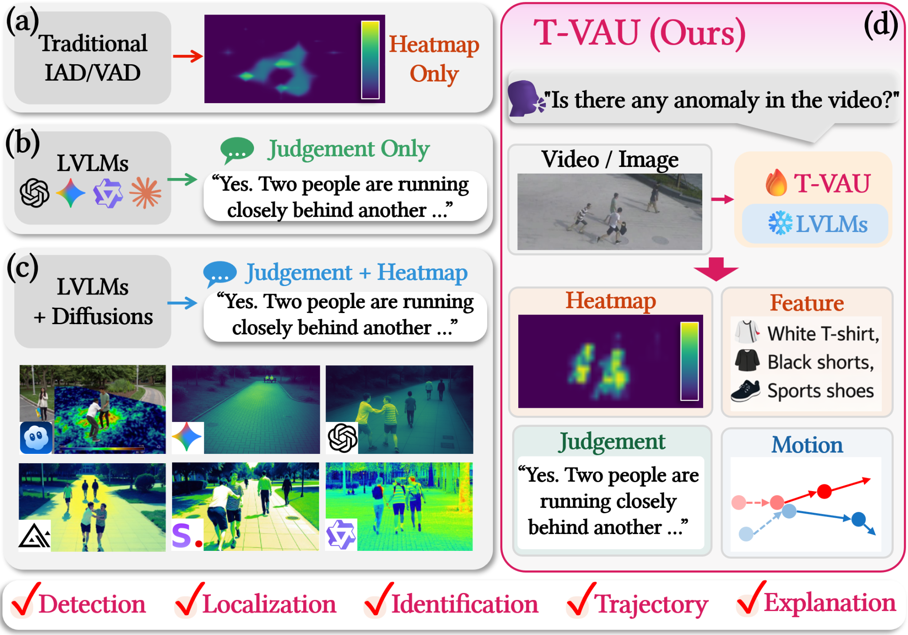
  

  <SlideCurrentNo /> / <SlidesTotal />

<!--
For video anomalies, a yes-or-no answer is not enough. We need to know where the abnormal pixels are, what target is involved, and how its motion becomes abnormal.
-->

---

What T-VAU adds

  

    
1. Pixel evidence

    

      Produce threshold-free spatio-temporal heatmaps instead of only clip-level anomaly scores.
    

    

      Anomaly Heatmap Decoder  
      (AHD for pixel-level evidence)
    

  

  

    
2. Region-aware prompting

    

      Convert heatmap dynamics into local, global, and learnable prompt embeddings for the LVLM.
    

    

      Region-aware Anomaly Encoder  
      (RAE + evidence-conditioned prompts)
    

  

  

    
3. Target-level supervision

    

      Provide aligned annotations for abnormal appearance, spatial localization, and motion trajectories.
    

    

      Fine-grained anomaly annotations  
      (Appearance + localization + trajectory)
    

  

  The core contribution is a closed loop: visual-text alignment → anomaly heatmaps → evidence-conditioned language reasoning.

  <SlideCurrentNo /> / <SlidesTotal />

<!--
T-VAU adds three pieces: pixel evidence, region-aware prompting, and target-level supervision. Together, they form a closed loop from visual-text alignment to heatmaps and then to language reasoning.
-->

---

  

    
Proposed Method

  

  <SlideCurrentNo /> / <SlidesTotal />

<!--
Next, I will describe the proposed method. The focus is how T-VAU turns visual evidence into prompts that an LVLM can use.
-->

---

T-VAU: closed-loop anomaly understanding

  Given a video clip and multi-turn queries, T-VAU predicts:

  

    

      Pixel-level spatio-temporal heatmaps 
      Explicit anomaly evidence,   Anomaly Heatmaps
    

    

      Language responses 
      Judgment, Appearance, Location, Motion,  Trajectory
    

    

      Trainable lightweight modules 
      Frozen Qwen2.5-VL 7B backbone + AHD + RAE  + LoRA prompt tuning.
    

  

  <SlideCurrentNo /> / <SlidesTotal />

  

    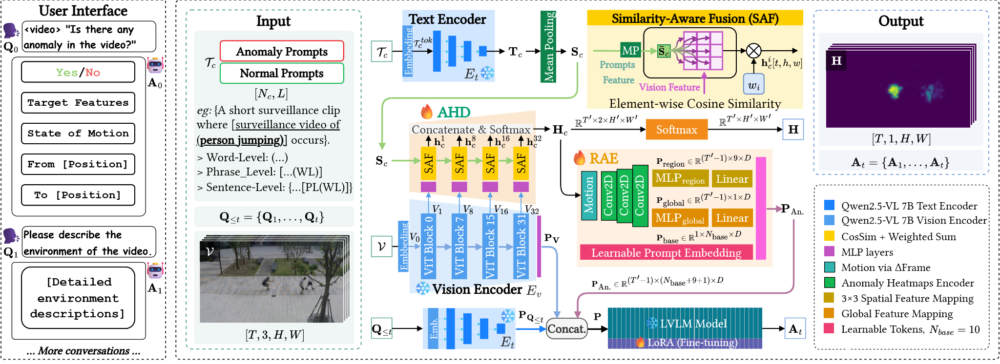
  

    

    Framework overview: Text Encoder + AHD + RAE + LVLM decoder.
  

  

  

  

  

<!--
Given a video and multi-turn questions, T-VAU outputs heatmaps and language answers. The backbone is frozen Qwen2.5-VL 7B, while AHD, RAE, and LoRA prompt tuning provide the trainable adaptation.
-->

---

Key idea

  

    
1. Align

    

      Use normal / abnormal text prompts to align intermediate visual tokens with semantic anomaly concepts.
    

    
Visual-text similarity  (Element-wise cosine similarity)

  

  

    
2. Ground

    

      Fuse similarity maps from multiscale ViT features to decode threshold-free heatmaps.
    

    
Anomaly Heatmap Decoder  (Similarity-Aware Fusion + AHD)

  

  

    
3. Reason

    

      Convert heatmap evidence into region-aware prompts and inject them into the LVLM.
    

    
Region-aware Anomaly Encoder  (RAE + dialogue context)

  

  Low-level anomaly evidence becomes structured language reasoning.

  <SlideCurrentNo /> / <SlidesTotal />

<!--
The method has three steps. First, align visual tokens with normal and abnormal text prompts. Then ground the anomaly as heatmaps, and finally use those heatmaps for reasoning.
-->

---

Anomaly Heatmap Decoder (AHD)

  
Purpose

  

    Generate pixel-level anomaly heatmaps by aligning visual tokens with text prompts.
  

  

    
Text prompts: normal vs. abnormal

    
Multiscale visual tokens: blocks 1, 8, 16, 32

    
Similarity-Aware Fusion:  cosine similarity + weighted sum

    

Softmax anomaly channel → heatmap $\mathbf{H}$

  

  

    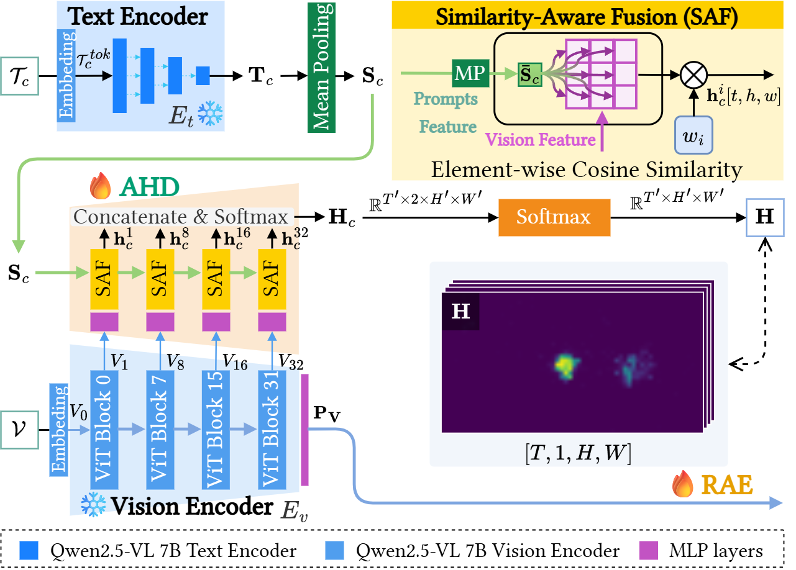
  

  

    Focus: Text Encoder + AHD + Similarity-Aware Fusion
  

  <SlideCurrentNo /> / <SlidesTotal />

<!--
AHD compares multiscale visual tokens from blocks 1, 8, 16, and 32 with normal and abnormal text embeddings. The fused similarity maps are passed through softmax, and the abnormal channel becomes the heatmap.
-->

---

Region-aware Anomaly Encoder (RAE)

  
Purpose

  

    Transform heatmap evidence into prompts that the LVLM can use for multi-turn reasoning.
  

  

  

Temporal difference: $\Delta\mathbf{H}_c$ captures motion cues

  

  
Lightweight convolutional backbone extracts region-aware features

  

$3\times3$ regional pooling captures local evidence

  
Global pooling + learnable base tokens capture clip-level anomaly context

  

  

  

    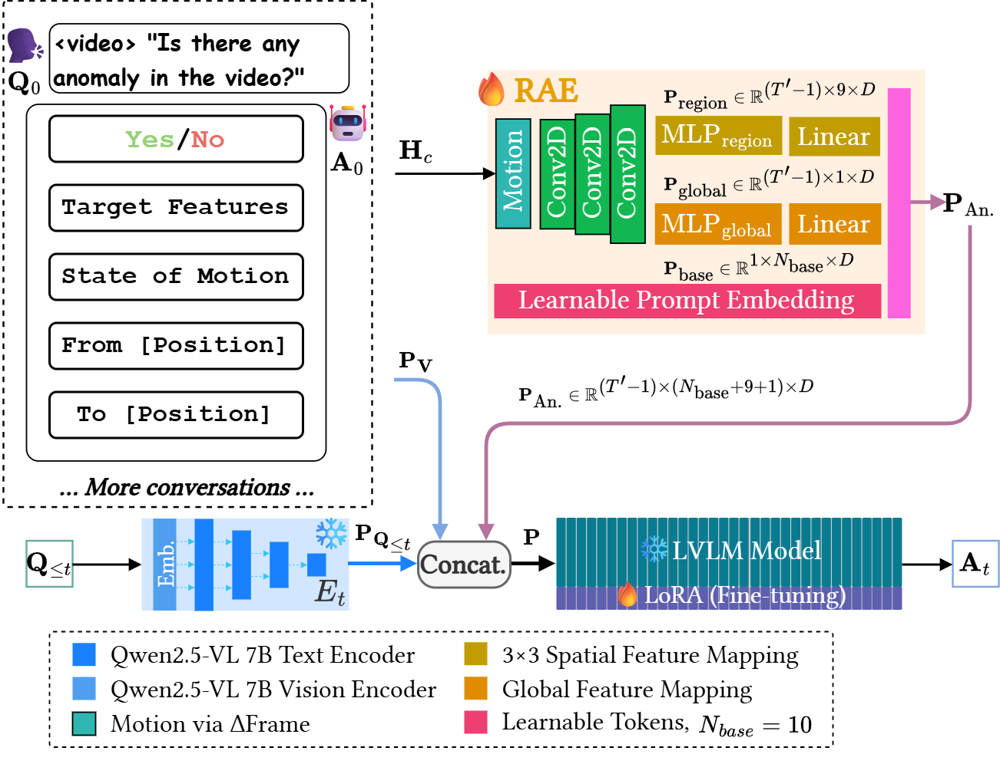
  

  

    Focus: heatmap evidence → region-aware prompt embedding → LVLM response
  

  <SlideCurrentNo /> / <SlidesTotal />

<!--
RAE starts from the heatmap sequence and its temporal differences. It extracts local grid features, global context, and learnable base prompts, then maps them into the LVLM prompt space.
-->

---

Multi-turn anomaly reasoning

  
Dialogue flow

  

  

  $Q_0$: Is there any anomaly in the video?

  

  

  $Q_1$: Describe anomaly target features.

  

  

  $Q_2$: What is the motion state?

  

  

  $Q_3$: From where to where?

  

  

  

    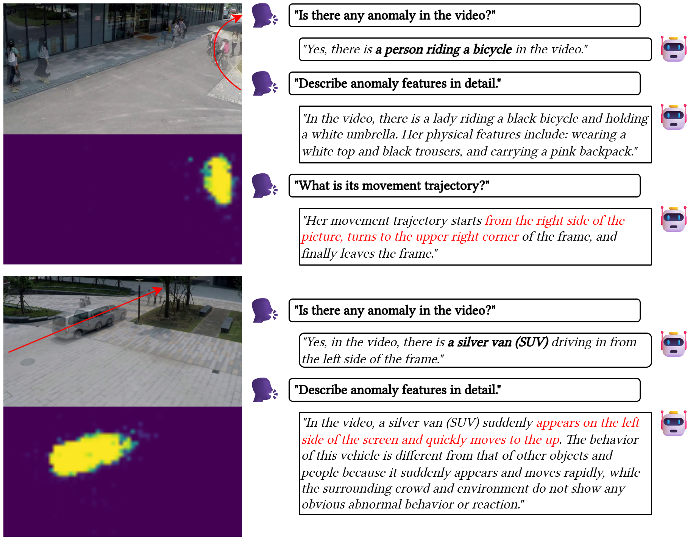
  

  The language output is constrained by spatial and temporal evidence, reducing target drift and hallucinated explanations.

  <SlideCurrentNo /> / <SlidesTotal />

<!--
The dialogue moves from simple judgment to detailed reasoning. The model first decides whether an anomaly exists, then describes the target, motion state, and trajectory using the same evidence chain.
-->

---

  

    
Fine-grained Dataset Construction

  

  <SlideCurrentNo /> / <SlidesTotal />

<!--
Now I will move to dataset construction. This part is needed because fine-grained reasoning requires supervision beyond masks or scores.
-->

---

Why construct a new supervision pipeline?

  

    Pixel masks alone do not teach the model to explain.
  

  

    

      VAD labels: anomaly score / mask
    

    

      Needed by T-VAU: target identity, appearance, position, motion, trajectory
    

    

      Solution: target-level video-text annotations derived from ShanghaiTech and UBnormal
    

  

  

    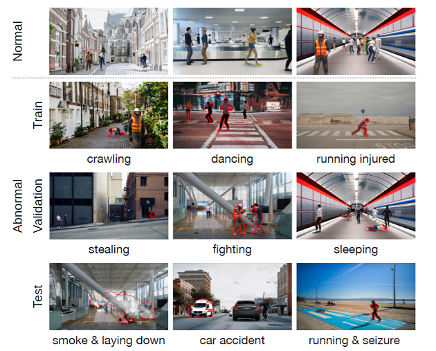
  

  

    UBnormal dataset examples (label mask only)
  

  <SlideCurrentNo /> / <SlidesTotal />

<!--
Pixel masks tell the model where the anomaly is, but not how to describe it. T-VAU needs target identity, appearance, position, motion, and trajectory, so we build target-level video-text annotations from ShanghaiTech and UBnormal.
-->

---

Dataset construction pipeline

  

    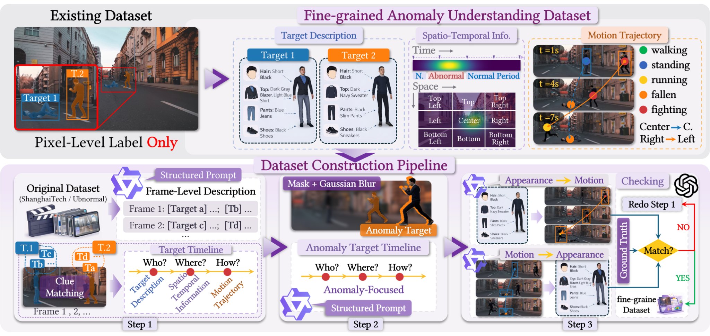
  

  

  Step 1 
  Frame-level structured prompting and temporal aggregation.
  

  

    Step 2 
    Mask-guided refinement with Gaussian-blurred background suppression.
  

  

    Step 3 
    Cross-modal consistency verification between appearance and motion.
  

  <SlideCurrentNo /> / <SlidesTotal />

<!--
The pipeline has three stages. We first extract frame-level structure, then refine it with anomaly masks and background suppression, and finally verify consistency between appearance and motion.
-->

---

Resulting supervision

  

    
Appearance

    

      Target-level attributes such as clothing, object type, and visible distinguishing cues.
    

  

  

    
Spatio-temporal localization

    

      Frame-wise target location and abnormal period supervision.
    

  

  

    
Motion trajectory

    

      Direction, state changes, and target path over time.
    

  

  ShanghaiTech: 4,108 train / 1,028 validation frame-wise annotations 
  Target-aligned descriptions: 5,136 ShanghaiTech samples + 7,912 UBnormal samples

  <SlideCurrentNo /> / <SlidesTotal />

<!--
The resulting supervision covers appearance, localization, and trajectory. It includes 4,108 training and 1,028 validation frame-wise annotations for ShanghaiTech, plus 5,136 ShanghaiTech and 7,912 UBnormal target-aligned descriptions.
-->

---

  

    
Experiments

  

  <SlideCurrentNo /> / <SlidesTotal />

<!--
Next are the experiments. I will show localization, dialogue evaluation, ablation, and qualitative results.
-->

---

Anomaly localization on UBnormal

  
AHD achieves strong localization

  

    Fine-tuned AHD improves micro-AUC, RBDC, and TBDC over prior baselines. Macro-AUC remains lower than the strongest multi-stream baseline.
  

  

    

      
94.8

      
Micro-AUC

    

    

      
87.8

      
Macro-AUC

    

    

      
67.8

      
RBDC

    

    

      
76.7

      
TBDC

    

  

  <table class="w-full text-xs bg-white/10 rounded-lg overflow-hidden border-collapse">
    <thead class="bg-white/20">
      <tr class="border-b border-white/20">
        <th rowspan="3" class="p-2 text-left align-middle">Method</th>
        <th colspan="4" class="p-2 text-center">Validation</th>
      </tr>
      <tr class="border-b border-white/20">
        <th colspan="2" class="p-2 text-center">AUC</th>
        <th rowspan="2" class="p-2 text-center align-middle">RBDC ↑</th>
        <th rowspan="2" class="p-2 text-center align-middle">TBDC ↑</th>
      </tr>
      <tr class="border-b border-white/20">
        <th class="p-2 text-center">Micro ↑</th>
        <th class="p-2 text-center">Macro ↑</th>
      </tr>
    </thead>
    <tbody>
      <tr class="border-t border-white/10">
        <td class="p-2">Georgescu et al.</td>
        <td class="p-2 text-center">58.5</td>
        <td class="p-2 text-center bg-green-400/20">94.4</td>
        <td class="p-2 text-center">18.580</td>
        <td class="p-2 text-center">48.213</td>
      </tr>
      <tr class="border-t border-white/10">
        <td class="p-2">Georgescu et al. (FT)</td>
        <td class="p-2 text-center">68.2</td>
        <td class="p-2 text-center bg-green-400/40 font-semibold">95.3</td>
        <td class="p-2 text-center">28.654</td>
        <td class="p-2 text-center">58.097</td>
      </tr>
      <tr class="border-t border-white/20">
        <td class="p-2">Sultani et al. (PT)</td>
        <td class="p-2 text-center">61.1</td>
        <td class="p-2 text-center">89.4</td>
        <td class="p-2 text-center">0.001</td>
        <td class="p-2 text-center">0.012</td>
      </tr>
      <tr class="border-t border-white/10">
        <td class="p-2">Sultani et al. (FT)</td>
        <td class="p-2 text-center">51.8</td>
        <td class="p-2 text-center">88.0</td>
        <td class="p-2 text-center">0.001</td>
        <td class="p-2 text-center">0.001</td>
      </tr>
      <tr class="border-t border-white/20">
        <td class="p-2">Bertasius et al. (FT, SR=1/32)</td>
        <td class="p-2 text-center">86.1</td>
        <td class="p-2 text-center">89.2</td>
        <td class="p-2 text-center">0.008</td>
        <td class="p-2 text-center">0.021</td>
      </tr>
      <tr class="border-t border-white/10">
        <td class="p-2">Bertasius et al. (FT, SR=1/8)</td>
        <td class="p-2 text-center">83.4</td>
        <td class="p-2 text-center">90.6</td>
        <td class="p-2 text-center">0.009</td>
        <td class="p-2 text-center">0.023</td>
      </tr>
      <tr class="border-t border-white/10">
        <td class="p-2">Bertasius et al. (FT, SR=1/4)</td>
        <td class="p-2 text-center">78.5</td>
        <td class="p-2 text-center">89.2</td>
        <td class="p-2 text-center">0.006</td>
        <td class="p-2 text-center">0.018</td>
      </tr>
      <tr class="border-t border-white/20">
        <td class="p-2 font-semibold">AHD (1S)</td>
        <td class="p-2 text-center bg-green-400/20 font-semibold">94.5</td>
        <td class="p-2 text-center">85.2</td>
        <td class="p-2 text-center bg-green-400/20 font-semibold">64.300</td>
        <td class="p-2 text-center bg-green-400/20 font-semibold">74.400</td>
      </tr>
      <tr class="border-t border-white/10 bg-pink-500/20">
        <td class="p-2 font-semibold">AHD (FT)</td>
        <td class="p-2 text-center bg-green-400/40 font-semibold">94.8</td>
        <td class="p-2 text-center font-semibold">87.8</td>
        <td class="p-2 text-center bg-green-400/40 font-semibold">67.800</td>
        <td class="p-2 text-center bg-green-400/40 font-semibold">76.700</td>
      </tr>
    </tbody>
  </table>

  

  Experimental results on UBnormal.
  We report micro-/macro-averaged frame-level AUC, RBDC, and TBDC (%) for the baselines
  Georgescu et al., Sultani et al., and Bertasius et al.
  PT, FT, and 1S denote pre-trained, fine-tuned, and one-shot; SR denotes frame sampling rate.
  Although only Georgescu et al. supports anomaly localization, we report RBDC and TBDC for all baselines for completeness.
  Best results are highlighted in bold with a green background.

  <SlideCurrentNo /> / <SlidesTotal />

<!--
On UBnormal, fine-tuned AHD reaches 94.8 micro-AUC, 87.8 macro-AUC, 67.8 RBDC, and 76.7 TBDC. It improves localization-oriented metrics over prior baselines, while macro-AUC remains below the strongest multi-stream baseline.
-->

---

Multi-turn dialogue evaluation

  
RAE improves language grounding

  

    One-shot evaluation compares representative LVLMs on target description, trajectory description, and Yes/No judgment.
  

  

      

        ShanghaiTech: 62.67 Target BLEU-4,
        88.84 Trajectory BLEU-4
      

      

        ShanghaiTech Yes/No: 97.67%
      

      

        UBnormal: 50.32 / 78.10 BLEU-4 and
        89.73% Yes/No
      

    

  

  <table class="w-full text-[10px] bg-white/10 rounded-lg overflow-hidden border-collapse">
    <thead class="bg-white/20">
      <tr class="border-b border-white/20">
        <th rowspan="3" class="p-1.5 text-left align-middle">Method</th>
        <th rowspan="3" class="p-1.5 text-center align-middle">Size ↓</th>
        <th colspan="3" class="p-1.5 text-center">ShanghaiTech</th>
        <th colspan="3" class="p-1.5 text-center">UBnormal</th>
      </tr>
      <tr class="border-b border-white/20">
        <th colspan="2" class="p-1.5 text-center">BLEU-4 ± Std ↑</th>
        <th class="p-1.5 text-center">Acc. ± Std ↑</th>
        <th colspan="2" class="p-1.5 text-center">BLEU-4 ± Std ↑</th>
        <th class="p-1.5 text-center">Acc. ± Std ↑</th>
      </tr>
      <tr class="border-b border-white/20">
        <th class="p-1.5 text-center">Target</th>
        <th class="p-1.5 text-center">Trajectory</th>
        <th class="p-1.5 text-center">Yes/No</th>
        <th class="p-1.5 text-center">Target</th>
        <th class="p-1.5 text-center">Trajectory</th>
        <th class="p-1.5 text-center">Yes/No</th>
      </tr>
    </thead>
    <tbody>
      <tr class="border-t border-white/10">
        <td class="p-1.5">Qwen2.5-VL (zero-shot)</td>
        <td class="p-1.5 text-center">7B</td>
        <td class="p-1.5 text-center">18.74 ± 0.82</td>
        <td class="p-1.5 text-center">27.33 ± 1.05</td>
        <td class="p-1.5 text-center">61.03 ± 0.38%</td>
        <td class="p-1.5 text-center">16.20 ± 0.85</td>
        <td class="p-1.5 text-center">24.18 ± 1.08</td>
        <td class="p-1.5 text-center">65.62 ± 0.41%</td>
      </tr>
      <tr class="border-t border-white/10">
        <td class="p-1.5">Qwen2.5-VL (one-shot)</td>
        <td class="p-1.5 text-center">7B</td>
        <td class="p-1.5 text-center">50.42 ± 0.58</td>
        <td class="p-1.5 text-center">78.91 ± 0.72</td>
        <td class="p-1.5 text-center">92.36 ± 0.24%</td>
        <td class="p-1.5 text-center">44.35 ± 0.62</td>
        <td class="p-1.5 text-center">70.82 ± 0.75</td>
        <td class="p-1.5 text-center">87.24 ± 0.27%</td>
      </tr>
      <tr class="border-t border-white/10">
        <td class="p-1.5">LLaVA-1.6 (one-shot)</td>
        <td class="p-1.5 text-center">7B</td>
        <td class="p-1.5 text-center">47.68 ± 0.60</td>
        <td class="p-1.5 text-center">75.42 ± 0.74</td>
        <td class="p-1.5 text-center">91.07 ± 0.26%</td>
        <td class="p-1.5 text-center">42.11 ± 0.64</td>
        <td class="p-1.5 text-center">68.07 ± 0.78</td>
        <td class="p-1.5 text-center">85.91 ± 0.28%</td>
      </tr>
      <tr class="border-t border-white/10">
        <td class="p-1.5">MiniCPM-V 2.6 (one-shot)</td>
        <td class="p-1.5 text-center">7B</td>
        <td class="p-1.5 text-center">52.34 ± 0.54</td>
        <td class="p-1.5 text-center">80.41 ± 0.69</td>
        <td class="p-1.5 text-center">93.11 ± 0.23%</td>
        <td class="p-1.5 text-center">46.70 ± 0.59</td>
        <td class="p-1.5 text-center bg-green-400/20">72.88 ± 0.73</td>
        <td class="p-1.5 text-center">86.94 ± 0.26%</td>
      </tr>
      <tr class="border-t border-white/10">
        <td class="p-1.5">Idefics2 (one-shot)</td>
        <td class="p-1.5 text-center">8B</td>
        <td class="p-1.5 text-center">44.29 ± 0.62</td>
        <td class="p-1.5 text-center">73.84 ± 0.76</td>
        <td class="p-1.5 text-center">90.12 ± 0.27%</td>
        <td class="p-1.5 text-center">39.51 ± 0.66</td>
        <td class="p-1.5 text-center">65.92 ± 0.80</td>
        <td class="p-1.5 text-center">84.03 ± 0.29%</td>
      </tr>
      <tr class="border-t border-white/10">
        <td class="p-1.5">InternVL (one-shot)</td>
        <td class="p-1.5 text-center">8B</td>
        <td class="p-1.5 text-center bg-green-400/20">55.73 ± 0.50</td>
        <td class="p-1.5 text-center bg-green-400/20">82.65 ± 0.66</td>
        <td class="p-1.5 text-center bg-green-400/20">94.28 ± 0.22%</td>
        <td class="p-1.5 text-center bg-green-400/20">49.84 ± 0.55</td>
        <td class="p-1.5 text-center">71.63 ± 0.70</td>
        <td class="p-1.5 text-center bg-green-400/20">88.65 ± 0.24%</td>
      </tr>
      <tr class="border-t-2 border-white/30 bg-pink-500/20">
        <td class="p-1.5 font-semibold">RAE (Ours) (one-shot)</td>
        <td class="p-1.5 text-center font-semibold">7B</td>
        <td class="p-1.5 text-center bg-green-400/40 font-semibold">62.67 ± 0.45</td>
        <td class="p-1.5 text-center bg-green-400/40 font-semibold">88.84 ± 0.53</td>
        <td class="p-1.5 text-center bg-green-400/40 font-semibold">97.67 ± 0.12%</td>
        <td class="p-1.5 text-center bg-green-400/40 font-semibold">50.32 ± 0.49</td>
        <td class="p-1.5 text-center bg-green-400/40 font-semibold">78.10 ± 0.58</td>
        <td class="p-1.5 text-center bg-green-400/40 font-semibold">89.73 ± 0.18%</td>
      </tr>
    </tbody>
  </table>
  

  One-shot evaluation results of representative LVLMs on our constructed dataset.
  “Size” denotes the number of model parameters in billions.
  BLEU-4 is reported for Target and Trajectory, and Accuracy for Yes/No.
  All metrics are in percentages.
  Our RAE performs best across tasks.

  <SlideCurrentNo /> / <SlidesTotal />

<!--
For multi-turn dialogue, RAE gives the best one-shot results in this table. On ShanghaiTech it reaches 62.67 Target BLEU-4, 88.84 Trajectory BLEU-4, and 97.67 percent Yes/No accuracy. On UBnormal it reaches 50.32 and 78.10 BLEU-4, with 89.73 percent Yes/No accuracy.
-->

---

Ablation: both modules are necessary

  
Complementary roles

  

    

      AHD supplies pixel-level evidence.
    

    

      RAE makes this evidence usable by the LVLM.
    

    

      Removing AHD makes heatmap metrics inapplicable.  Removing RAE leaves heatmaps but removes evidence-conditioned dialogue.
    

  

  <table class="w-full text-[10px] bg-white/10 rounded-lg overflow-hidden border-collapse">
    <thead class="bg-white/20">
      <tr class="border-b border-white/20">
        <th rowspan="2" class="p-1.5 text-left align-middle">Method</th>
        <th class="p-1.5 text-center">Size ↓</th>
        <th colspan="2" class="p-1.5 text-center">Heatmap (UBnormal) ↑</th>
        <th colspan="2" class="p-1.5 text-center">BLEU-4 (ShanghaiTech) ↑</th>
        <th class="p-1.5 text-center">Acc. (S.T.) ↑</th>
      </tr>
      <tr class="border-b border-white/20">
        <th class="p-1.5 text-center">Parameters</th>
        <th class="p-1.5 text-center">RBDC ± Std</th>
        <th class="p-1.5 text-center">TBDC ± Std</th>
        <th class="p-1.5 text-center">Target ± Std</th>
        <th class="p-1.5 text-center">Trajectory ± Std</th>
        <th class="p-1.5 text-center">Yes/No ± Std</th>
      </tr>
    </thead>
    <tbody>
      <tr class="border-t border-white/10">
        <td class="p-1.5">T-VAU w/o AHD</td>
        <td class="p-1.5 text-center">8299.71M</td>
        <td class="p-1.5 text-center">--</td>
        <td class="p-1.5 text-center">--</td>
        <td class="p-1.5 text-center">61.82 ± 0.42</td>
        <td class="p-1.5 text-center">85.47 ± 0.51</td>
        <td class="p-1.5 text-center">95.38 ± 0.18%</td>
      </tr>
      <tr class="border-t border-white/10">
        <td class="p-1.5">T-VAU w/o RAE</td>
        <td class="p-1.5 text-center">8317.13M</td>
        <td class="p-1.5 text-center">67.8 ± 0.36</td>
        <td class="p-1.5 text-center">76.7 ± 0.41</td>
        <td class="p-1.5 text-center">--</td>
        <td class="p-1.5 text-center">--</td>
        <td class="p-1.5 text-center">--</td>
      </tr>
      <tr class="border-t border-white/10">
        <td class="p-1.5">T-VAU w/o AHD & RAE</td>
        <td class="p-1.5 text-center">8274.74M</td>
        <td class="p-1.5 text-center">--</td>
        <td class="p-1.5 text-center">--</td>
        <td class="p-1.5 text-center">61.82 ± 0.42</td>
        <td class="p-1.5 text-center">85.47 ± 0.51</td>
        <td class="p-1.5 text-center">95.38 ± 0.18%</td>
      </tr>
      <tr class="border-t-2 border-white/30 bg-pink-500/20">
        <td class="p-1.5 font-semibold">T-VAU</td>
        <td class="p-1.5 text-center font-semibold">8324.67M</td>
        <td class="p-1.5 text-center font-semibold">67.8 ± 0.36</td>
        <td class="p-1.5 text-center font-semibold">76.7 ± 0.41</td>
        <td class="p-1.5 text-center font-semibold">62.67 ± 0.45</td>
        <td class="p-1.5 text-center font-semibold">88.84 ± 0.53</td>
        <td class="p-1.5 text-center font-semibold">97.67 ± 0.12%</td>
      </tr>
    </tbody>
  </table>
  

    Table:
    Results of different T-VAU variants.
    “Parameters/Size” denotes the number of model parameters in millions.
    Heatmap metrics include RBDC and TBDC.
    BLEU-4 is reported for both Target and Trajectory.
    Accuracy is evaluated on Yes/No classification.
  

  <SlideCurrentNo /> / <SlidesTotal />

<!--
The ablation shows that AHD and RAE play different roles. AHD supplies local heatmap evidence, and RAE converts that evidence into useful language prompts. The full model gives the best complete result.
-->

---

  

    
Qualitative Results

  

  <SlideCurrentNo /> / <SlidesTotal />

<!--
Finally, I show qualitative results. These examples check whether the model's text is supported by spatial and temporal evidence.
-->

---

Evidence-grounded multi-turn QA

  

    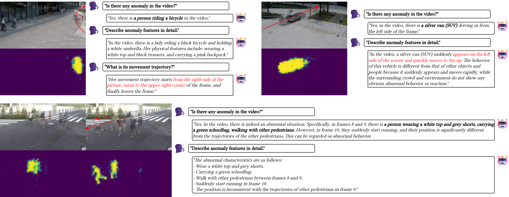
  

  

    AHD localizes the abnormal target rather than the whole scene.
  

  

    RAE guides target-specific appearance and motion descriptions.
  

  

    The dialogue remains consistent across judgment, features, and trajectory.
  

  <SlideCurrentNo /> / <SlidesTotal />

<!--
In these examples, AHD focuses on the anomalous target instead of the whole scene. RAE then keeps the answers consistent across anomaly judgment, appearance, motion, and trajectory.
-->

---

Trajectory consistency

  

    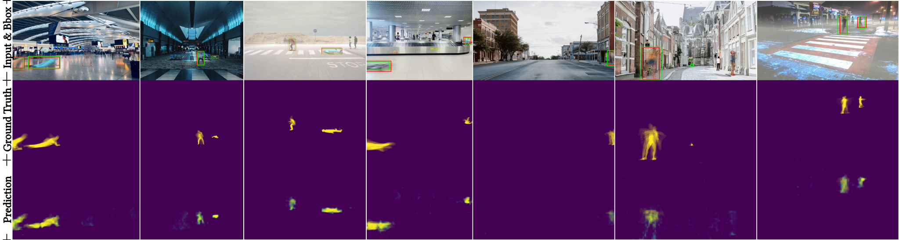
  

  Accumulated predictions follow the ground-truth anomaly regions over time, supporting motion and trajectory reasoning.

  <SlideCurrentNo /> / <SlidesTotal />

<!--
The accumulated masks and boxes show how predictions move over time. The predicted trajectory follows the ground-truth anomaly regions, supporting the motion explanation.
-->

---

Takeaway

  

    T-VAU closes the loop from
    pixel evidence
    to
    language reasoning.
  

  

    
AHD: threshold-free spatio-temporal anomaly heatmaps

    
RAE: region-aware and motion-aware prompt injection

    
Dataset: target-level appearance, localization, and trajectory supervision

  

  

    
  

  
Possible next directions

  

    
Broader real-world scenes

    
Stronger long-term temporal reasoning

    
Efficient deployment for live video

  

  <SlideCurrentNo /> / <SlidesTotal />

<!--
The takeaway is that T-VAU closes the loop from pixel evidence to language reasoning. AHD localizes the anomaly, RAE injects the evidence into the LVLM, and the dataset supervises target-level appearance, localization, and trajectory.
-->

---

  
  

    
Thank you

    
<b>Jihao (Geo) Gu</b>

    
momiji-bit.github.io

  

  
BibTeX

  <pre class="m-0 text-[13px] leading-relaxed font-mono whitespace-pre-wrap break-words text-gray-200"><code>@inproceedings{gu2026tvau,
  author    = {Gu, Jihao and Li, Kun and Wang, He and Ak{\c{s}}it, Kaan},
  title     = {Text-guided Fine-Grained Video Anomaly Understanding},
  booktitle = {Proceedings of the IEEE/CVF Conference on Computer Vision and Pattern Recognition
               (CVPR) Workshops, 2nd Workshop on Subtle Visual Computing (SVC)},
  year      = {2026},
  address   = {Denver, CO, USA},
  url       = {https://openaccess.thecvf.com/content/CVPR2026W/SVC/html/Gu_Text-guided_Fine-Grained_Video_Anomaly_Understanding_CVPRW_2026_paper.html},
}</code></pre>

  

    Acknowledgments: Alex Chapiro; HPC system at the United Arab Emirates University.
  

    
<a href="#" class="text-2xl text-gray-100 hover:text-blue-400 transition-colors font-semibold">Project Page</a>
  

    
  

  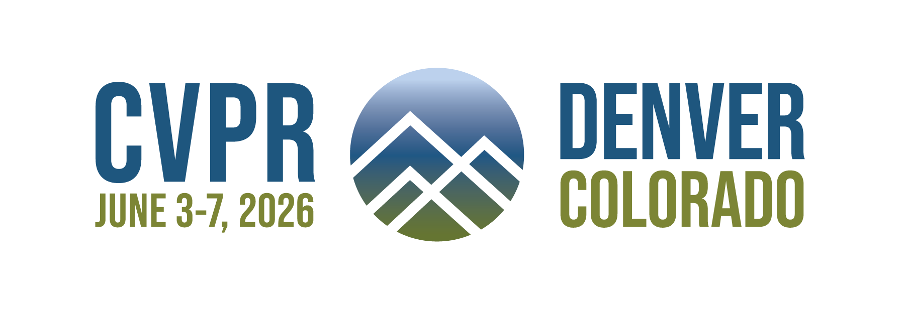

  <SlideCurrentNo /> / <SlidesTotal />

<!--
Thank you. The main message is that subtle video anomalies need evidence-grounded reasoning, not only anomaly scores. I am happy to discuss questions.
-->
